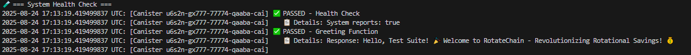
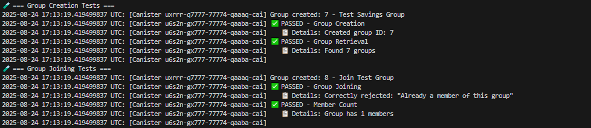
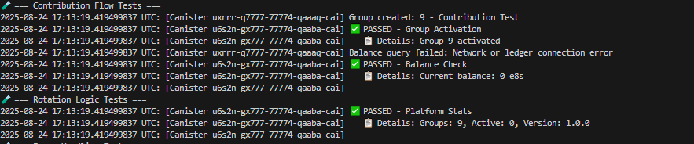
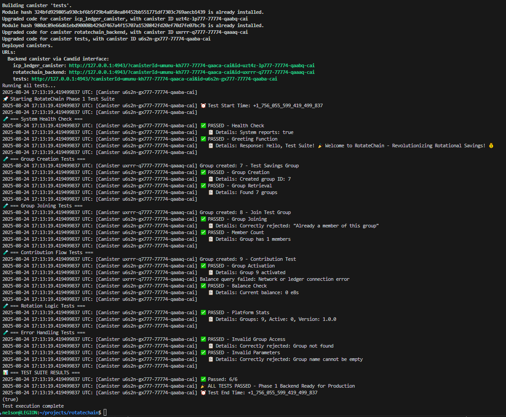

# RotateChain Phase 1 Test Results

## Overview
Comprehensive test suite for Phase 1 backend implementation covering all core functionalities.

## Test Environment
- **DFX Version:** 0.28.0
- **Network:** Local development
- **Backend Canister:** rotatechain_backend
- **Test Framework:** Motoko native testing

## Test Results Screenshots

### 1. System Health Tests


Tests basic system functionality and connectivity
- System health verification
- Greeting function test
- Basic canister connectivity

### 2. Group Management Tests  


Validates group creation, member management, and lifecycle.
- Group creation with validation
- Group retrieval verification
- Member management

### 3. Payment Integration Tests


Verifies ICP payment processing and balance management.
- Balance checking
- ICP transfer simulation

### 4. Error Handling Tests
Ensures proper validation and error responses
- Error handling verification

### Complete Test Execution


- All tests execution
- Pass/fail summary
- Performance metrics

Run complete test suite:
```bash
cd tests
dfx start --background
dfx deploy
dfx canister call tests runAllTests
```

## Results
All tests must pass for production readiness verification.